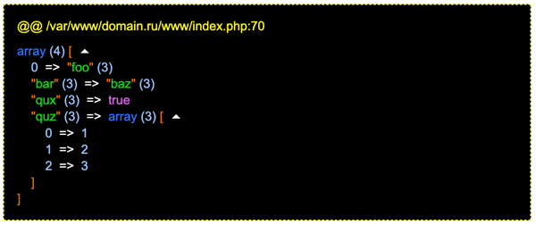
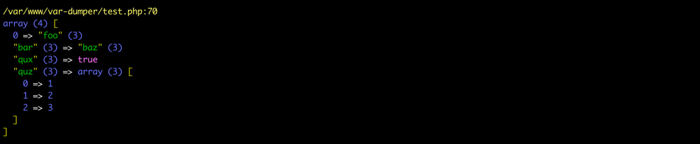

# Var Dumper

[![Latest Version][badge-release]][packagist]
[![Software License][badge-license]][license]
[![PHP Version][badge-php]][php]
![Coverage Status][badge-coverage]
[![Total Downloads][badge-downloads]][downloads]
[![Support mail][badge-mail]][mail]

Выводит и оформляет информацию о переменной.

## Установка

Установить этот пакет можно как зависимость, используя Composer.

``` bash
composer require fi1a/var-dumper
```

## dump и dumpDie

Пакет добавляет глобальную функцию `dump`, которую можно использовать вместо `var_dump`.
С помощью различных обработчиков вывод осуществляется, используя HTML или цветной в командную строку.

Пример:

```php
$var = [
    'foo',
    'bar' => 'baz',
    'qux' => true,
    'quz' => [
        1, 2, 3
    ],
];

dump($var);
```

Обработчик вывода выбирается на основе текущего PHP SAPI.

HTML вывод:



Вывод в консоли:



Функция `dumpDie` аналогична функции `dump`, только завершает работу скрипта.

[badge-release]: https://img.shields.io/packagist/v/fi1a/var-dumper?label=release
[badge-license]: https://img.shields.io/github/license/fi1a/var-dumper?style=flat-square
[badge-php]: https://img.shields.io/packagist/php-v/fi1a/var-dumper?style=flat-square
[badge-coverage]: https://img.shields.io/badge/coverage-100%25-green
[badge-downloads]: https://img.shields.io/packagist/dt/fi1a/var-dumper.svg?style=flat-square&colorB=mediumvioletred
[badge-mail]: https://img.shields.io/badge/mail-support%40fi1a.ru-brightgreen

[packagist]: https://packagist.org/packages/fi1a/var-dumper
[license]: https://github.com/fi1a/var-dumper/blob/master/LICENSE
[php]: https://php.net
[downloads]: https://packagist.org/packages/fi1a/var-dumper
[mail]: mailto:support@fi1a.ru